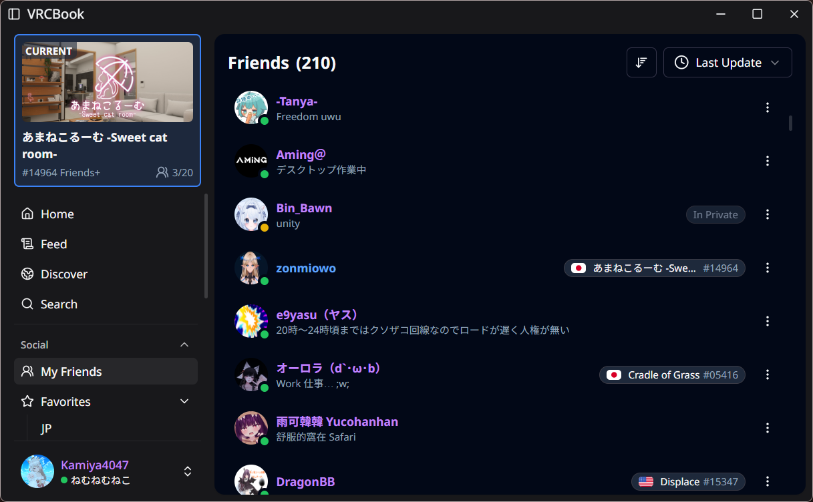
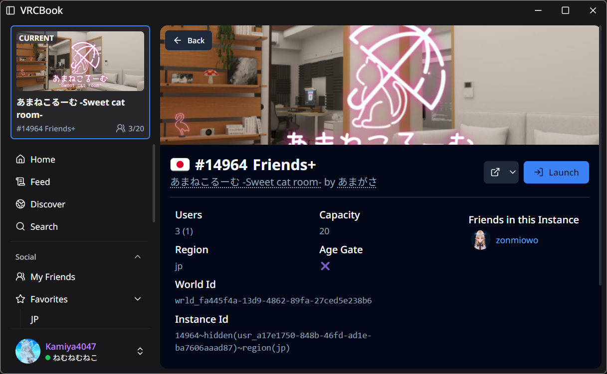
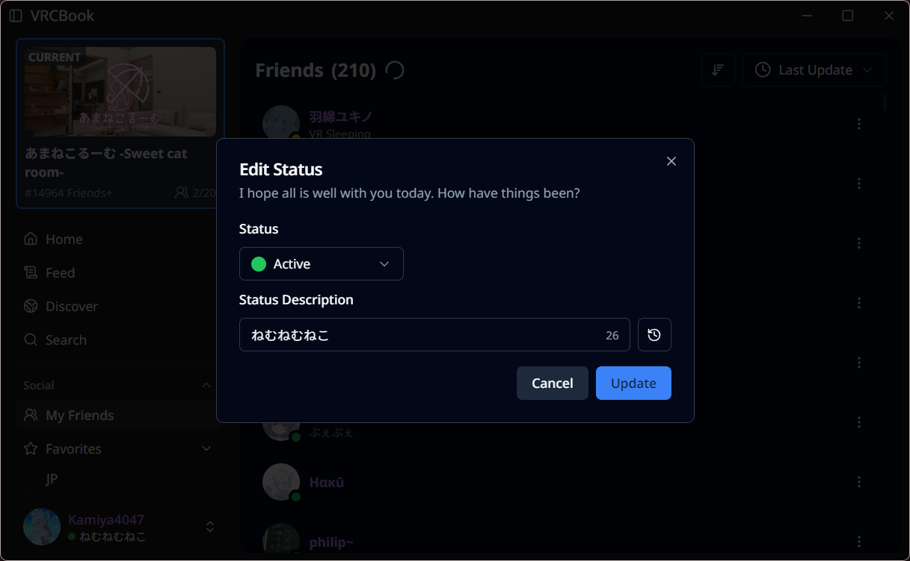

# VRCBook

VRCBook is a assistant/companion tool for VRChat, inspired by [VRCX](https://github.com/vrcx-team/VRCX). This application is made and aimed to provide a improved and more modern solution for friendship/content management.

> [!IMPORTANT]
> The project is currently under heavy construction and only rely on unofficial VRChat API, use at own risk.

## Project Status

This project uses Tauri + React.js, with Next.js like folder structure.

### Routes

- [x] `/login`
  - [x] `/totp`
  - [ ] `/otp`
  - [ ] `/emailotp`
- [ ] `/app`
  - [ ] `/game-log`
  - [ ] `/discover`
  - [ ] `/search`
  - [x] `/settings`
  - `/social`
    - [ ] `/favorites/[index]`
    - [x] `/moderation`
  - `/world`
    - [ ] `/own`
    - [ ] `/favorites/[index]`
  - `/avatar`
    - [ ] `/own`
    - [ ] `/favorites/[index]`
  - [x] `/user/:id`
  - [x] `/instance/:id`

### Recommended IDE Setup

- [VS Code](https://code.visualstudio.com/) + [Tauri](https://marketplace.visualstudio.com/items?itemName=tauri-apps.tauri-vscode) + [rust-analyzer](https://marketplace.visualstudio.com/items?itemName=rust-lang.rust-analyzer)

## Screenshots

